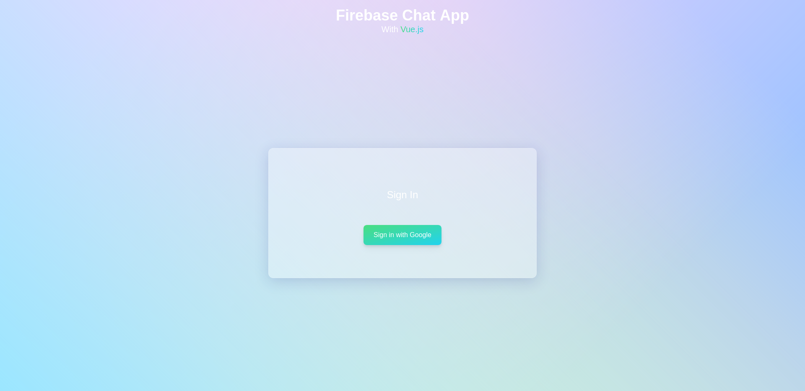
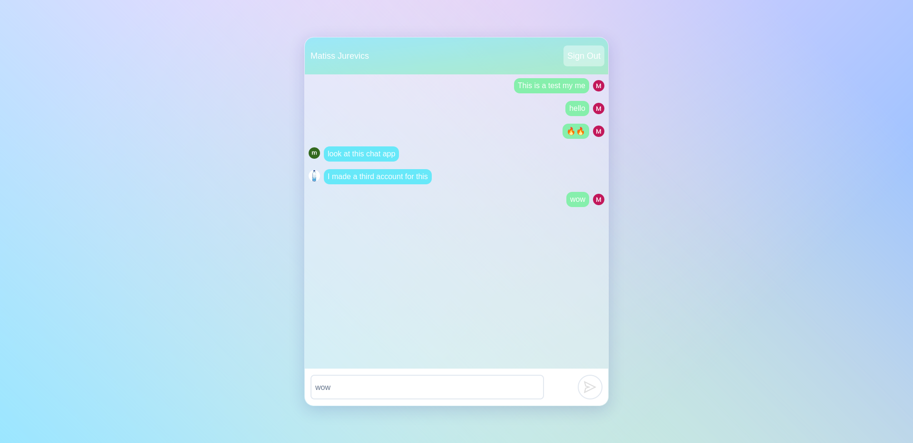

# Chat app with Vuejs & Firebase 🔥
Demo: https://projects.firechat.saetom.xyz

## What is this
Ever since I started making web app I always wanted to make a chat app like this and so I thought it was a great time to do this when I started learning how to use firebase. This app allows you to log in with a google account and send messages.

### Built with
- Vuejs
- Firebase
- Tailwindcss

Note: When making this app I was NOT following a course of any sort (This is the first time I've made an app with new tech that i learned by reading the documentation exclusively)